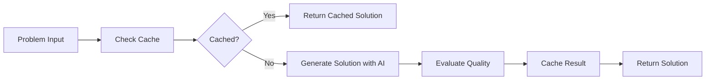

# Self-Improving AI Agent Documentation

## Table of Contents
1. [Overview](#overview)
2. [Architecture](#architecture)
3. [Key Features](#key-features)
4. [Installation & Setup](#installation--setup)
5. [Core Components](#core-components)
6. [How It Works](#how-it-works)
7. [Usage Guide](#usage-guide)
8. [Memory Optimization](#memory-optimization)
9. [Configuration](#configuration)
10. [API Reference](#api-reference)

## Overview

The Self-Improving AI Agent is a sophisticated machine learning system designed to autonomously solve programming problems while continuously improving its performance through iterative learning cycles. Built on Google's Gemini AI, this agent demonstrates meta-learning capabilities by analyzing its own performance and adapting its problem-solving strategies over time.

### Purpose

- **Autonomous Problem Solving**: Automatically generates solutions to programming challenges
- **Continuous Learning**: Improves performance through self-evaluation and pattern recognition
- **Memory Efficiency**: Implements advanced memory management techniques for scalability
- **Performance Tracking**: Monitors and reports on improvement metrics over time

### Key Capabilities

- Solves various programming problems (algorithms, data structures, system design, ML)
- Evaluates its own solutions for quality
- Learns from successful and failed attempts
- Adapts problem-solving strategies based on performance
- Manages memory efficiently to prevent resource exhaustion

## Architecture

```
self-improving-agent/
├── src/
│   ├── config/
│   │   ├── config.py          # Configuration management
│   │   ├── logger.py          # Logging system
│   │   └── settings.py        # Data models and settings
│   ├── prompts/
│   │   └── prompt_manager.py  # Prompt template management
│   ├── main.py               # Core agent implementation
│   ├── storage.py            # Memory-efficient storage
│   ├── problem_generator.py  # Problem generation utilities
│   └── resources.py          # Resource monitoring tools
├── prompts/                  # Prompt template files
│   ├── analysis.txt
│   ├── evaluation.txt
│   ├── improvement.txt
│   ├── learning.txt
│   └── solution.txt
└── run.py                    # Main entry point
```

## Key Features

### 1. **Self-Improvement Mechanism**
The agent learns from each problem-solving attempt by:
- Tracking successful strategies
- Analyzing failure patterns
- Updating capability scores
- Adapting approaches based on performance

### 2. **Memory-Efficient Design**
- Bounded collections with automatic cleanup
- Weak reference caching
- Lazy loading of prompts
- Periodic garbage collection
- Memory usage monitoring

### 3. **Performance Analytics**
- Real-time performance metrics
- Success rate tracking
- Memory usage monitoring
- Execution time analysis
- Comprehensive reporting

### 4. **Flexible Problem Solving**
- Supports various problem types
- Multiple solution approaches
- Quality evaluation system
- Strategy pattern recognition

## Installation & Setup

### Prerequisites
```bash
Python 3.8+
Google Gemini API key
```

### Installation
```bash
# Clone the repository
git clone <repository-url>
cd self-improving-agent

# Install dependencies
pip install -r requirements.txt

# Create .env file
echo "GOOGLE_API_KEY=your-gemini-api-key" > .env
```

### Project Dependencies
```python
google-generativeai  # Gemini AI integration
psutil              # System resource monitoring
python-dotenv       # Environment variable management
pydantic            # Data validation
```

## Core Components

### 1. **SelfImprovingAgent** (`main.py`)

The central intelligence system that orchestrates problem-solving and learning.

```python
agent = SelfImprovingAgent(api_key, logger, llm_config)
```

**Key Methods:**
- `solve_problem()`: Generates solutions using AI
- `run_improvement_cycle()`: Executes learning iterations
- `get_performance_report()`: Generates analytics
- `save_state()/load_state()`: Persistence functionality

### 2. **MemoryEfficientStorage** (`storage.py`)

Implements automatic memory management with configurable thresholds.

```python
storage = MemoryEfficientStorage(max_items=1000, memory_threshold=0.8)
```

**Features:**
- Automatic cleanup when memory exceeds threshold
- Bounded collections (deque with maxlen)
- Periodic memory usage checks
- Efficient garbage collection

### 3. **PromptManager** (`prompt_manager.py`)

Manages AI prompts with lazy loading and caching.

```python
prompt = PromptManager.get_prompt('solution', problem=problem_text)
```

**Capabilities:**
- Lazy loading from files
- Weak reference caching
- Fallback templates
- Memory-efficient formatting

### 4. **Logger** (`logger.py`)

Comprehensive logging system with file rotation and error tracking.

```python
logger = Logger(name="agent", level=logging.INFO)
```

**Features:**
- Console and file output
- Error log separation
- Automatic log directory creation
- Clean shutdown handling

### 5. **ProblemGenerator** (`problem_generator.py`)

Generates problems on-demand using generator patterns.

```python
for problem in problem_gen.iterate_problems():
    agent.solve_problem(problem)
```

## How It Works

### 1. **Problem Solving Pipeline**



### 2. **Learning Cycle**

```python
# 1. Initialize agent
agent = SelfImprovingAgent(api_key, logger, config)

# 2. Run improvement cycles
for cycle in range(num_cycles):
    # Process problems
    for problem in problems:
        result = agent.solve_problem(problem)
        agent._process_result(result)
    
    # Learn from results
    agent._learn_from_cycle(results)
    
    # Update capabilities
    agent._update_capabilities(performance_metrics)
```

### 3. **Capability Evolution**

The agent tracks five core capabilities:
- **Problem Solving**: General problem-solving ability
- **Code Generation**: Quality of generated code
- **Optimization**: Efficiency of solutions
- **Error Handling**: Robustness of solutions
- **Efficiency**: Resource usage optimization

Each capability score ranges from 0.0 to 1.0 and improves based on performance.

## Usage Guide

### Basic Usage

```python
from src.config.config import Config
from src.config.logger import Logger
from src.config.settings import LLMConfig
from src.agent import SelfImprovingAgent

# Initialize
config = Config()
logger = Logger()
llm_config = LLMConfig()
agent = SelfImprovingAgent(config.google_api_key, logger, llm_config)

# Solve a single problem
problem = "Write a function to find the nth Fibonacci number"
result = agent.solve_problem(problem)
print(f"Solution quality: {result.quality_score}")

# Run improvement cycles
problems = [
    "Implement binary search",
    "Create a stack data structure",
    "Design a caching system"
]
agent.run_improvement_cycle(problems, cycles=3)

# Get performance report
print(agent.get_performance_report())
```

### Advanced Usage with Generators

```python
from src.problem_generator import ProblemGenerator

# Use generator for memory efficiency
problem_gen = ProblemGenerator()
agent.run_improvement_cycle_generator(
    problem_gen.iterate_problems(), 
    cycles=5
)
```

### State Persistence

```python
# Save agent state
agent.save_state("agent_state.json")

# Load previous state
new_agent = SelfImprovingAgent(api_key, logger, config)
new_agent.load_state("agent_state.json")
```

## Memory Optimization

### 1. **Bounded Collections**
```python
# Automatically removes old items when limit reached
self.successful_strategies = deque(maxlen=50)
self.failed_attempts = deque(maxlen=20)
```

### 2. **Weak Reference Caching**
```python
# Allows garbage collection of unused cache entries
self.solutions_cache = weakref.WeakValueDictionary()
```

### 3. **Periodic Cleanup**
```python
def _periodic_cleanup(self):
    if len(self.solutions_cache) > 50:
        # Remove oldest entries
        keys_to_remove = list(self.solutions_cache.keys())[:25]
        for key in keys_to_remove:
            del self.solutions_cache[key]
    gc.collect()
```

### 4. **Memory Monitoring**
```python
with memory_monitor(logger, "Operation"):
    # Memory-tracked operation
    result = agent.solve_problem(problem)
```

## Configuration

### Environment Variables (`.env`)
```env
GOOGLE_API_KEY=your-api-key-here
```

### LLM Configuration (`settings.py`)
```python
class LLMConfig(BaseModel):
    model: str = 'gemini-2.5-flash-preview-05-20'
    problem_solving: float = 0.5
    code_generation: float = 0.5
    learning_efficiency: float = 0.5
    error_handling: float = 0.5
```

### Storage Configuration
```python
# Customize storage limits
storage = MemoryEfficientStorage(
    max_items=500,           # Maximum items to store
    memory_threshold=0.7     # Cleanup at 70% memory usage
)
```

## API Reference

### SelfImprovingAgent

#### Constructor
```python
SelfImprovingAgent(api_key: str, logger: Any, llm_config: Any)
```

#### Methods

**solve_problem(problem: str) -> SolutionResult**
- Generates a solution for the given problem
- Returns: SolutionResult with solution, quality score, and metrics

**run_improvement_cycle(problems: List[str], cycles: int) -> None**
- Runs improvement cycles on a list of problems
- Updates agent capabilities based on performance

**get_performance_report() -> str**
- Generates a comprehensive performance report
- Includes metrics, capabilities, and memory usage

**save_state(filepath: str) -> None**
- Saves agent state to JSON file
- Preserves capabilities and recent patterns

**load_state(filepath: str) -> None**
- Loads agent state from JSON file
- Restores capabilities and learning history

**cleanup() -> None**
- Cleans up all resources
- Clears caches and forces garbage collection

### SolutionResult

```python
@dataclass
class SolutionResult:
    problem: str           # Problem description
    solution: str          # Generated solution
    quality_score: float   # Quality rating (0.0-1.0)
    execution_time: float  # Time taken in seconds
    memory_used: float     # Memory used in MB
    approach: str          # Solution approach used
    error: Optional[str]   # Error message if failed
```

### PerformanceMetrics

```python
@dataclass
class PerformanceMetrics:
    timestamp: float       # Unix timestamp
    cycle: int            # Cycle number
    avg_score: float      # Average quality score
    memory_used: float    # Memory usage in MB
    success_rate: float   # Success percentage
```

## Best Practices

### 1. **Resource Management**
- Always call `agent.cleanup()` when done
- Use context managers for memory tracking
- Monitor memory usage in production

### 2. **Problem Design**
- Keep problem descriptions concise
- Use diverse problem types for better learning
- Include various difficulty levels

### 3. **Performance Tuning**
- Adjust cycle count based on needs
- Configure memory thresholds appropriately
- Use generators for large problem sets

### 4. **Error Handling**
- Check solution results for errors
- Monitor quality scores
- Implement retry logic for failures

## Troubleshooting

### Common Issues

**1. High Memory Usage**
- Reduce `max_items` in storage configurations
- Increase cleanup frequency
- Use generator patterns for problems

**2. Low Quality Scores**
- Increase number of improvement cycles
- Provide more diverse problems
- Check prompt templates

**3. API Rate Limits**
- Implement request throttling
- Cache more aggressively
- Use batch processing

## Future Enhancements

- **Distributed Processing**: Multi-agent collaboration
- **Advanced Learning**: Neural architecture search
- **Domain Specialization**: Task-specific optimization
- **Real-time Adaptation**: Online learning capabilities
- **Visualization**: Performance dashboard and metrics graphs

## Conclusion

The Self-Improving AI Agent represents a sophisticated approach to autonomous problem-solving with continuous learning capabilities. Its memory-efficient design and comprehensive monitoring make it suitable for production environments where resource management is critical. The modular architecture allows for easy extension and customization to meet specific requirements.